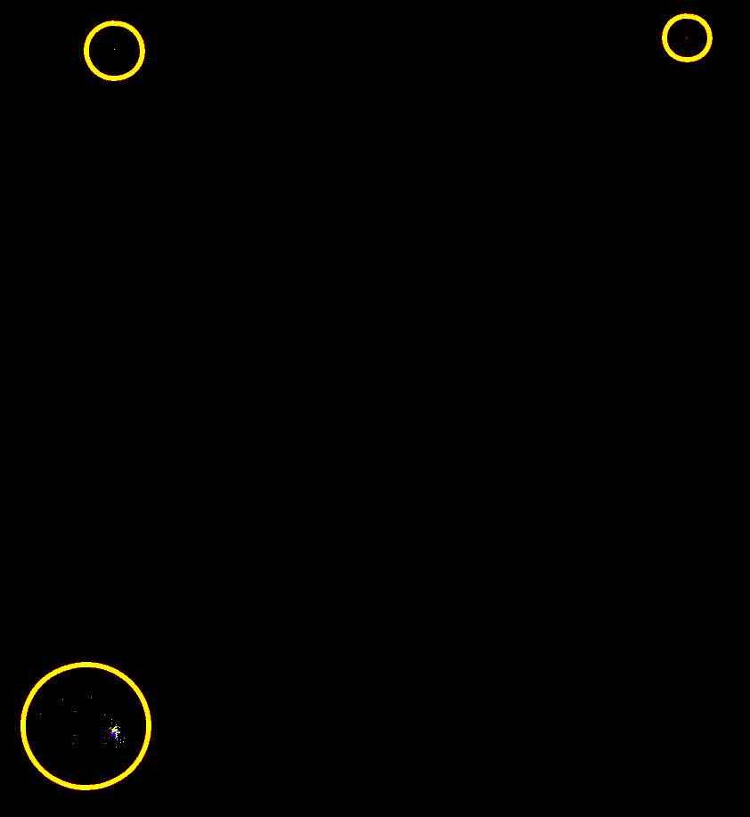
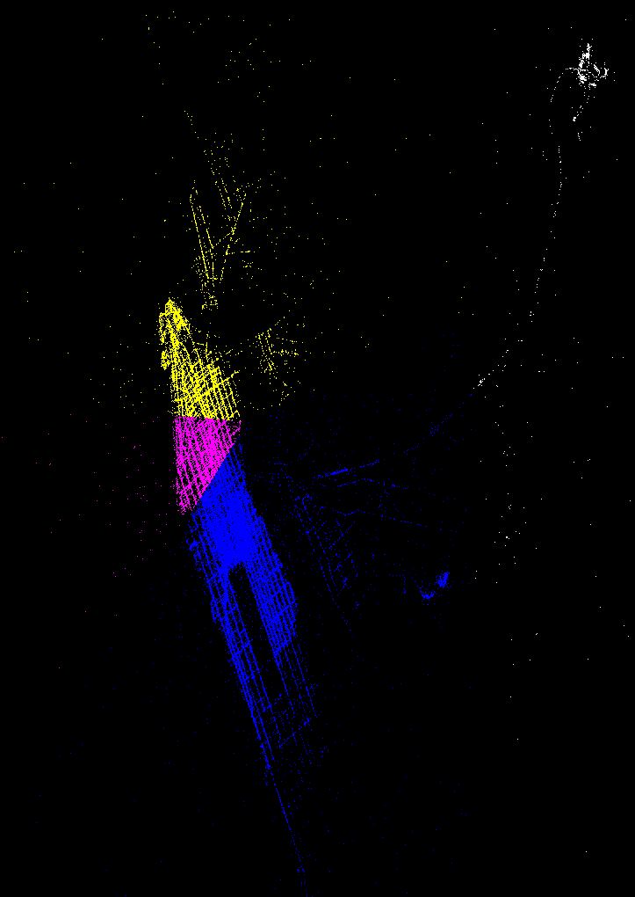

# k-means
The k-means algorithm implemented in C++.
The algorithm can be visualized as it goes.

## Dependencies
The project was made using the
[Simple and Fast Multimedia Library (SFML)](https://www.sfml-dev.org/)
using version ```2.5.1-2```.
The project hasn't been tested on any other version of the library.

## Data file
Inside ```main.cpp```, change the value for the constant ```DATA_FILENAME```
in line 6. The program will look for the file inside a folder
named **data** at the root of the project.

The data file must have the two coordinates separated by a space.
Example of a valid file:
```
-73.987927999999997 40.737884999999999
-73.956007999999997 40.779558000000002
-73.955744999999993 40.689503000000002
-73.983985000000004 40.754644999999996
-73.959131999999997 40.769264999999997
-73.982212000000004 40.783087999999999
-73.982119999999995 40.776826999999997
-73.984804999999994 40.741872999999998
-73.991181999999995 40.730004999999998
-73.790966999999995 40.645921999999999
```

**IMPORTANT:** The file should only contain the data. No headers or metadata.

### For the given sample
The given sample file was preprocessed to meet the above requirement.
The file should be ready to use by deleting
the first two lines of the original file
(the one with the name of the columns and the blank line) and running the
following command, which will give us the desired format.
```bash
awk -F "," '{print $6, $7}' sample.csv > points.ssv
```

## Usage
On start, the porgram will prompt for the
desired number of clusters to be found.
On its current state, the program will work well with **up to 7 clusters**.
This due to only having 7 colors in the ```colors``` array in line 9.
If you don't mind colors between clusters being random (and probably being very
similar to each other),
you can comment line 46 and uncomment lines 47 and 48.
This will let you set a higher amount of cluster with different colors 
(hopefully).

Also, 

### Controls
If you press X, the view will be centered on the big point concentration 
(bottom-left) of the given sample file.
If you press Z, you will return to the full view of the given sample.
You can drag the mouse to move around.
You can use the mouse scroll wheel to zoom in and out.

## Opinion
The dataset is too tight (the points are too close to each other) for the
k-means algorithm to be efficient and give good results.

## Example of the visualization
### Full view

### Main cluster (bottom left)

